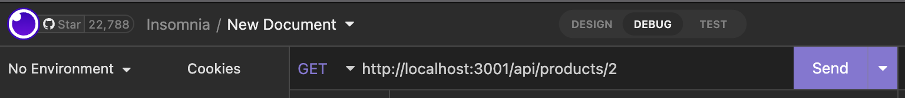

# ORM-E-Commerce

### Licenses

 ## Description
 This backend application is useful for a small e-commerce buisness to store and organize data. Data on categories, products, tags, and more. This application allows users to retrieve data, create new categories, products, or tags, update exisitng data, and delete data. This backend application is simple and easy to use.
 
 ## How To

 In order to use this applications users should have node.js and MySQL. Users should also install the MySQL2 npm and the Seqelize npm. Connect the Express.js API to the MySQL database and the dotenv package. Users should also have insomnia to run this application on. MySQL workbench is beneficial to have installed aswell.  

  * Step One: Find and click on the Schema.sql file. Open the terminal and begin a MySQL session. Run the schema.sql file by typing 'source schema.sql'.

  * Step Two: Find and click on the server.js file. Open the terminal and type "npm i" followed by "npm run seed", followed by "npm start". This will get the application up and running. 

  * Step Three: Open your insomnia applcation and you can run the GET, POST, UPDATE, and DELETE routes. 

## DEMO
 [DEMO](https://drive.google.com/file/d/1AQHhp81pLe4RTErs6-zex6MejHsm9CR_/view?usp=sharing)

 ## Credits & Resources
 I used many examples from the UT resources provided in class.